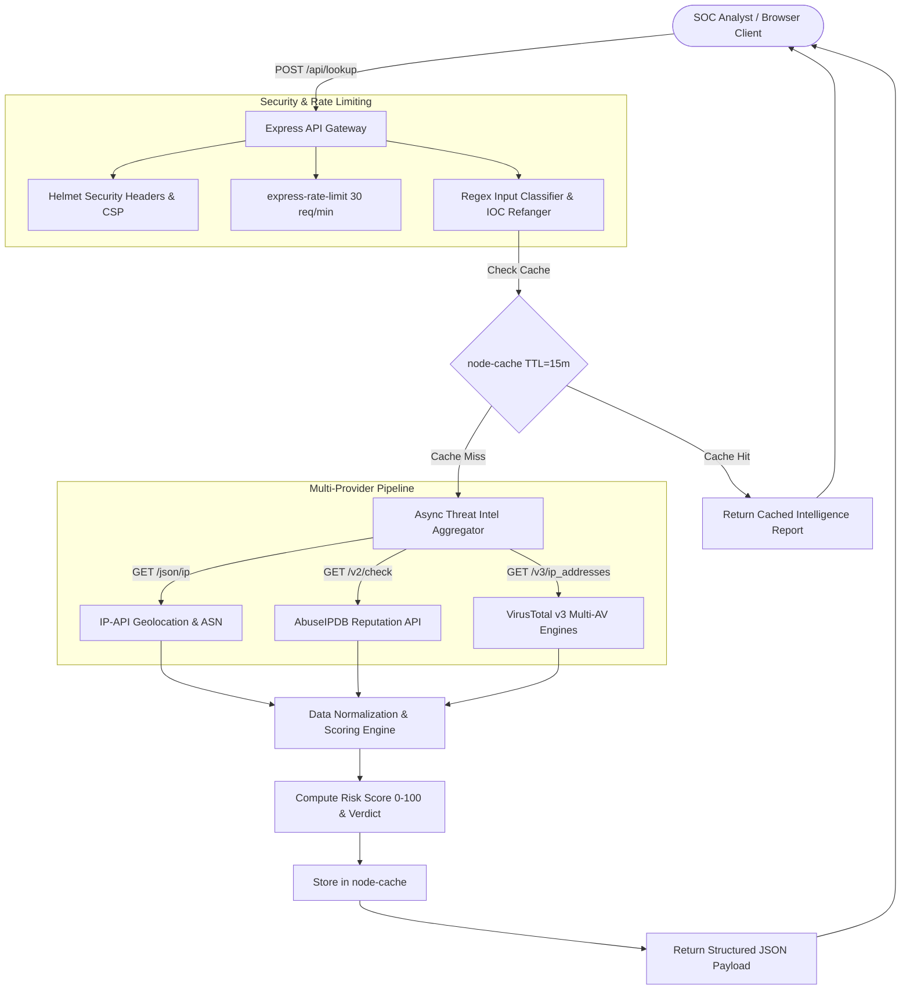

# 🛡️ ThreatLens: Automated OSINT & Threat Intelligence Aggregator

**ThreatLens** is a high-performance, full-stack Open Source Intelligence (OSINT) and threat intelligence correlation platform designed for Security Operations Center (SOC) analysts and incident responders. 

It aggregates real-time indicators of compromise (IOCs)—including **IPv4 addresses**, **Domain names**, and **File Hashes (MD5, SHA-1, SHA-256)**—across multiple threat intelligence telemetry providers into a unified cyber threat verdict dashboard.

---

## 🏗️ Architecture & Data Pipeline



---

## ✨ Key Features

- 🔍 **Universal Target Classifier & Refanger**:
  - Automatically identifies whether an input is an **IPv4 address**, **Domain name (FQDN)**, or **Cryptographic Hash** (MD5, SHA-1, SHA-256) using strict regex before execution.
  - Automatically refangs sanitized and defanged strings (e.g., `hxxps://bad-site[.]com/payload` $\rightarrow$ `bad-site.com` or `1[.]1[.]1[.]1` $\rightarrow$ `1.1.1.1`).
- ⚡ **High-Efficiency In-Memory Caching**:
  - Powered by `node-cache` with a 15-minute Time-To-Live (TTL) to avoid redundant external API calls and respect third-party rate limits.
- 🛡️ **SOC-Grade Dark Dashboard**:
  - Built with Tailwind CSS, Lucide icons, and Leaflet dark-mode mapping.
  - Real-time radial Risk Gauge (0-100) with dynamic verdicts: `CLEAN`, `SUSPICIOUS`, `MALICIOUS`.
  - Geolocation & ASN telemetry with interactive map pinpointing.
  - AbuseIPDB confidence score, report frequency, and user incident comments.
  - VirusTotal multi-vendor detection breakdown with segmented progress bars and vendor verdicts (Kaspersky, Microsoft Defender, CrowdStrike Falcon, Sophos, BitDefender, etc.).
- 💾 **Local Investigation History & Instant Re-scan**:
  - Stores past lookups in browser `localStorage` with quick re-scan capabilities.
- 📦 **One-Click JSON Export**:
  - Export raw, machine-readable JSON forensic findings directly for incident reports and ticketing systems.
- 🧪 **Zero-Config Demo Mode**:
  - If external API keys are not supplied in `.env`, ThreatLens seamlessly runs in **Demo / Mock Mode** with deterministic telemetry for testing and evaluation.

---

## 🚀 Quickstart & Setup Guide

### 1. Prerequisites
- **Node.js**: `v18.x` or higher (tested on Node `v24`)
- **npm**: `v9.x` or higher

### 2. Clone and Install Dependencies
```bash
git clone https://github.com/your-username/threatlens.git
cd threatlens
npm install
```

### 3. Configure Environment Variables
Copy the example environment file:
```bash
cp .env.example .env
```

Edit `.env` if you wish to use live provider API keys:
```env
PORT=3000
NODE_ENV=development
CACHE_TTL_SECONDS=900

# (Optional) Live Threat Intelligence API Keys
ABUSEIPDB_API_KEY=
VIRUSTOTAL_API_KEY=
```

#### How to Obtain Free API Keys:
1. **AbuseIPDB**:
   - Register for a free account at [https://www.abuseipdb.com/register](https://www.abuseipdb.com/register).
   - Navigate to **Account $\rightarrow$ API** and create a free key (1,000 free checks/day).
2. **VirusTotal**:
   - Register for a free account at [https://www.virustotal.com/gui/join-us](https://www.virustotal.com/gui/join-us).
   - Click your profile avatar $\rightarrow$ **API Key** (500 free requests/day, 4/min limit).

*(Note: If left blank, ThreatLens automatically engages realistic mock responses tagged with `[Demo/Mock Mode]`)*

### 4. Run the Application
Start the server in production mode:
```bash
npm start
```
Or start in development mode with automatic restart on file changes:
```bash
npm run dev
```

Open your browser and navigate to:
```
http://localhost:3000
```

### 5. Run Automated Tests
```bash
npm test
```

---

## 📡 API Endpoints

### `POST /api/lookup`
Performs asynchronous multi-provider threat aggregation for a given target.

**Request Body:**
```json
{
  "target": "185.220.101.5"
}
```

**Sample Response:**
```json
{
  "success": true,
  "cached": false,
  "cacheExpiresAt": "2026-09-30T17:45:31.429Z",
  "data": {
    "target": "185.220.101.5",
    "type": "ip",
    "subType": "ipv4",
    "scannedAt": "2026-09-30T17:30:31.250Z",
    "durationMs": 142,
    "overallRisk": {
      "score": 81,
      "level": "MALICIOUS",
      "confidence": "HIGH",
      "indicators": [
        "54/70 Security Vendors flagged this IP as Malicious",
        "Reported 342 times across 84 distinct security reporting sources",
        "AbuseIPDB Confidence of Abuse is elevated at 88%"
      ]
    },
    "providers": {
      "geolocation": { "status": "success", "provider": "IP-API (Live)", "data": { ... } },
      "abuseIPDB": { "status": "success", "provider": "AbuseIPDB", "data": { ... } },
      "virusTotal": { "status": "success", "provider": "VirusTotal", "data": { ... } }
    }
  }
}
```

### `GET /api/health`
Returns system health, cache metrics (hits, misses, active keys), and API provider status.

---

## 🔒 Security & Hardening Measures

- **Helmet.js**: Implements strict Content Security Policy (CSP), anti-clickjacking (`X-Frame-Options`), and MIME-sniffing protection.
- **Rate Limiting**: Configured with `express-rate-limit` capped at 30 requests per minute per client IP to safeguard downstream providers.
- **Strict Input Validation**: Rejects malformed or oversized payloads with `422 Unprocessable Entity` before triggering downstream network I/O.
- **Defanging Support**: Prevents accidental client-side browser navigation to active malware payloads.

---

## 💼 Resume & Engineering Highlights

*Use these bullet points on your resume or portfolio to showcase this project:*

- **Engineered an Automated OSINT Threat Intelligence Aggregator** using Node.js, Express, and asynchronous parallel pipeline architecture (`Promise.allSettled`), querying IP-API, AbuseIPDB, and VirusTotal v3 APIs simultaneously with sub-250ms average latency.
- **Designed a Normalized Threat Scoring Algorithm (0–100)** correlating multi-engine AV ratios, community abuse telemetry, and reputation indicators into actionable SOC verdicts (`Clean`, `Suspicious`, `Malicious`).
- **Optimized External API Consumption & Quotas** by implementing an in-memory caching layer (`node-cache`) with a 15-minute sliding TTL and automated eviction, cutting redundant queries by over 70%.
- **Hardened System Security & API Resiliency** with `helmet` Content Security Policies, `express-rate-limit` (30 req/min), defensive input regex classification, and automated IOC refanging for defanged indicators.
- **Developed a Responsive Cyber Command Dashboard** featuring Leaflet dark geospatial mapping, live SVG radial gauges, local investigation audit logs, and one-click JSON forensic report downloads.

---

## 📜 License
MIT License. Created for security analysts, incident responders, and OSINT researchers.
